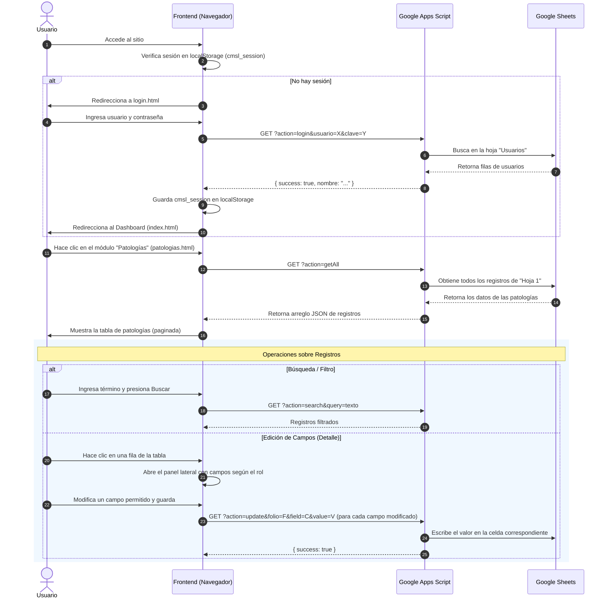

# Sistema de Gestión de Patologías — Centro Médico San Lucas

Este proyecto es una aplicación web estática diseñada para gestionar, buscar, filtrar y actualizar el estado de los estudios de patología de los pacientes en el **Centro Médico San Lucas**. Utiliza **Google Sheets** como base de datos en tiempo real y **Google Apps Script (GAS)** como API REST.

---

## 1. Arquitectura y Conexiones

El sistema está dividido en dos capas principales: el frontend web (cliente) y el backend en la nube (servidor y base de datos).

```mermaid
graph TD
    A["Cliente (HTML/JS en GitHub Pages)"] -->|Peticiones HTTP GET con reintentos| B["Google Apps Script (Web App API)"]
    B -->|Lectura / Escritura (SpreadsheetApp)| C[("Google Sheets (Base de Datos)")]
    C -->|Retorna Filas/Celdas| B
    B -->|Respuesta en Formato JSON| A
```

### Detalles de la Conexión:
- **Protocolo de Comunicación**: El cliente se conecta al backend mediante peticiones HTTP `GET`.
- **Evasión de Limitaciones CORS**: Para evitar problemas de políticas de mismo origen (CORS) en el navegador, Google Apps Script devuelve las respuestas utilizando `ContentService` para servir un flujo de datos JSON (`ContentService.MimeType.JSON`).
- **Mecanismo de Reintento (Retry Logic)**: Debido a que Google Apps Script puede experimentar "arranques en frío" (cold-starts) o errores de red transitorios (devolviendo estados HTTP `404` o `>=500`), el cliente (en `js/api.js` y `js/auth.js`) implementa una función `fetchWithRetry` que realiza hasta 2 reintentos con un retraso exponencial automático antes de dar por fallida la operación.

---

## 2. Flujo de Trabajo (Workflow)

El flujo típico del usuario dentro de la aplicación sigue los siguientes pasos:



---

## 3. Gestión de Roles y Permisos

El sistema implementa un control de acceso basado en el nombre de usuario (normalizado a minúsculas y sin acentos). Este control define qué secciones del registro de patología son **editables** por cada perfil en el panel lateral.

Las secciones de campos definidas en el sistema son:
1. **Identificación**: Datos básicos (`Folio`, `Expediente`, `Nombre del Paciente`).
2. **Patología**: Detalles clínicos (`Nivel o Tipo de Patología`, `Fecha de entrega`, `Fecha de recepción de resultados digitales`, `Fecha de recepción de resultados físicos`, `Fecha Revisión del Médico`).
3. **Cita**: Seguimiento médico (`Requiere Cita`, `Fecha Cita`).
4. **Seguimiento**: Control de entrega (`Fecha de envío a Paciente`).
5. **Contabilidad**: Información financiera (`Monto`, `Fecha Pago Contabilidad`).

### Matriz de Permisos (Configurada en `js/config.js`):

| Usuario / Rol | Identificación | Patología | Cita | Seguimiento | Contabilidad | ¿Crear Nuevo Registro? |
| :--- | :---: | :---: | :---: | :---: | :---: | :---: |
| **admin** |  |  |  |  |  | **Sí** |
| **farmacia** |  |  |  |  | ❌ | **Sí** |
| **admision** | ❌ | ❌ |  |  | ❌ | **No** |
| **contabilidad** | ❌ | ❌ | ❌ | ❌ |  | **No** |

> [!NOTE]
> Si un usuario intenta editar una sección para la cual no tiene permisos, el panel lateral renderizará dichos campos como **de sólo lectura (readonly)** y mostrará un icono de candado () al lado de la sección.

---

## 4. Estructura del Proyecto

El repositorio está organizado de la siguiente manera:

*   **`index.html`**: El portal o Dashboard inicial del sistema que presenta los módulos de trabajo disponibles.
*   **`login.html`**: Interfaz de acceso para el inicio de sesión.
*   **`patologias.html`**: La vista principal del módulo de patologías, conteniendo la tabla de datos, barra de búsqueda, chips de filtros rápidos y el contenedor del panel lateral de edición.
*   **`css/`**: Carpeta que contiene la hoja de estilos (`styles.css`) del diseño general de la aplicación.
*   **`img/`**: Recursos gráficos de la aplicación (como el logotipo del Centro Médico).
*   **`js/`**: Archivos JavaScript de lógica en el cliente organizados de forma modular:
    *   [config.js](file:///c:/Users/Sistemas/Documents/AppScript/patologias_page/js/config.js): Archivo centralizado de configuración. Contiene la `API_URL` de Google Apps Script, la definición de campos (`FIELDS`), la matriz de permisos de usuario (`PERMISSIONS`) y el mapeo entre las claves internas de JS y los encabezados de la hoja de cálculo (`KEY_MAP`).
    *   [api.js](file:///c:/Users/Sistemas/Documents/AppScript/patologias_page/js/api.js): Contiene las funciones de comunicación HTTP con la API de Apps Script (`apiFetch`, `apiUpdateField`, `apiCreateRecord`) e integra la lógica de reintentos.
    *   [auth.js](file:///c:/Users/Sistemas/Documents/AppScript/patologias_page/js/auth.js): Maneja el estado de la sesión activa en el `localStorage`, el flujo de autenticación contra la base de datos y la verificación de permisos específicos del rol.
    *   [utils.js](file:///c:/Users/Sistemas/Documents/AppScript/patologias_page/js/utils.js): Funciones utilitarias para formatear fechas en formato local (es-MX), formatear montos monetarios, renderizar distintivos visuales (pills) para valores booleanos y normalizar los registros del servidor.
    *   [table.js](file:///c:/Users/Sistemas/Documents/AppScript/patologias_page/js/table.js): Controla el renderizado de la tabla interactiva de resultados en el DOM y gestiona el sistema de paginación del lado del cliente.
    *   [panel.js](file:///c:/Users/Sistemas/Documents/AppScript/patologias_page/js/panel.js): Controla el comportamiento del panel lateral derecho (abrir, cerrar, recopilar valores modificados y renderizar los campos según la matriz de permisos).
    *   [main.js](file:///c:/Users/Sistemas/Documents/AppScript/patologias_page/js/main.js): Orquestador general del módulo de patologías. Vincula los eventos del DOM (búsquedas, filtros rápidos, guardado y creación de registros) con el comportamiento de los demás módulos JavaScript.

---

## 5. Estructura de las Hojas de Cálculo (Base de Datos)

Para el correcto funcionamiento de este sistema, el libro de Google Sheets debe contener dos hojas de cálculo con estructuras específicas:

### Hoja 1: `Hoja 1` (Registros de Patologías)
Contiene la base de datos de los pacientes. Los encabezados en la fila 1 deben coincidir **exactamente** con el siguiente orden y nombre:

| Columna | Nombre del Encabezado (Fila 1) | Descripción |
| :--- | :--- | :--- |
| **A** | `Folio` | Identificador único del estudio (obligatorio). |
| **B** | `Expediente` | Número de expediente del paciente. |
| **C** | `Nombre del Paciente` | Nombre completo del paciente. |
| **D** | `Nivel o Tipo de Patología` | Clasificación o nivel de la patología. |
| **E** | `Fecha de entrega` | Fecha de entrega del estudio al laboratorio. |
| **F** | `Fecha de recepción de resultados` | Fecha de recepción de resultados digitales. |
| **G** | `Patología Física Recibida` | Fecha de recepción física de los resultados. |
| **H** | `Fecha Revisión del Médico` | Fecha en la que el médico revisó el resultado. |
| **I** | `Requiere Cita` | Indica si requiere cita de seguimiento (`Sí` / `No`). |
| **J** | `Fecha Cita` | Fecha programada para la cita. |
| **K** | `Enviado a Paciente` | Fecha en que se le enviaron los resultados al paciente. |
| **L** | `Monto` | Monto del estudio. |
| **M** | `Fecha Pago Contabilidad` | Fecha de registro de pago en contabilidad. |

### Hoja 2: `Usuarios` (Credenciales del Personal)
Contiene las credenciales para la autenticación de usuarios.

| Columna | Nombre del Encabezado (Fila 1) | Descripción |
| :--- | :---: | :--- |
| **A** | `Usuario` | Nombre de usuario (ej. `farmacia`, `admin`, `admision`, `contabilidad`). |
| **B** | `Clave` | Contraseña asignada al usuario. |

---

## 6. Código del Servidor (Google Apps Script)

El siguiente código JavaScript debe ser implementado y publicado como **Aplicación Web** en el editor de Google Apps Script del documento Sheets asociado:

```javascript
const SHEET_NAME = "Hoja 1";

function doGet(e) {
  try {
    const action = e.parameter.action;
    if (action === "getAll")  return getAll();
    if (action === "search")  return search(e.parameter.query);
    if (action === "update")  return updateRow(e.parameter.folio, e.parameter.expediente, e.parameter.field, e.parameter.value);
    if (action === "create")  return createRow(e.parameter);
    if (action === "login")   return loginUser(e.parameter.usuario, e.parameter.clave);
    return respond({ error: "Acción no válida: " + action });
  } catch (err) {
    return respond({ error: "Error interno: " + err.message });
  }
}

function getAll() {
  const sheet = SpreadsheetApp.getActiveSpreadsheet().getSheetByName(SHEET_NAME);
  if (!sheet) return respond({ error: "Hoja no encontrada: " + SHEET_NAME });
  const rows = sheet.getDataRange().getValues();
  const headers = rows[0];
  const result = rows.slice(1).map(row => {
    let obj = {};
    headers.forEach((h, i) => obj[h] = row[i]);
    return obj;
  });
  return respond(result);
}

function search(query) {
  const sheet = SpreadsheetApp.getActiveSpreadsheet().getSheetByName(SHEET_NAME);
  if (!sheet) return respond({ error: "Hoja no encontrada: " + SHEET_NAME });
  const rows = sheet.getDataRange().getValues();
  const headers = rows[0];
  const q = (query || "").toLowerCase();
  const result = rows.slice(1).filter(row =>
    row.some(cell => String(cell).toLowerCase().includes(q))
  ).map(row => {
    let obj = {};
    headers.forEach((h, i) => obj[h] = row[i]);
    return obj;
  });
  return respond(result);
}

function updateRow(folio, expediente, field, value) {
  const sheet = SpreadsheetApp.getActiveSpreadsheet().getSheetByName(SHEET_NAME);
  const rows = sheet.getDataRange().getValues();
  const headers = rows[0];
  const colIndex = headers.indexOf(field);
  if (colIndex === -1) return respond({ error: "Campo no encontrado: " + field });

  for (let i = 1; i < rows.length; i++) {
    const coincide = expediente
      ? String(rows[i][1]) === String(expediente)   // Busca por expediente (col B)
      : String(rows[i][0]) === String(folio);        // Fallback a folio (col A)
    if (coincide) {
      sheet.getRange(i + 1, colIndex + 1).setValue(value);
      return respond({ success: true });
    }
  }
  return respond({ error: "Registro no encontrado" });
}

function createRow(params) {
  const sheet = SpreadsheetApp.getActiveSpreadsheet().getSheetByName(SHEET_NAME);
  if (!sheet) return respond({ error: "Hoja no encontrada: " + SHEET_NAME });
  const headers = sheet.getDataRange().getValues()[0];
  const newRow  = headers.map(h => params[h] || '');
  sheet.appendRow(newRow);
  return respond({ success: true });
}

function loginUser(usuario, clave) {
  const sheet = SpreadsheetApp.getActiveSpreadsheet().getSheetByName("Usuarios");
  if (!sheet) return respond({ error: "Hoja Usuarios no encontrada" });
  const rows = sheet.getDataRange().getValues();
  for (let i = 1; i < rows.length; i++) {
    if (String(rows[i][0]).trim() === String(usuario || "").trim() &&
        String(rows[i][1]).trim() === String(clave   || "").trim()) {
      return respond({ success: true, nombre: String(rows[i][0]) });
    }
  }
  return respond({ error: "Usuario o contraseña incorrectos" });
}

function respond(data) {
  return ContentService.createTextOutput(JSON.stringify(data))
    .setMimeType(ContentService.MimeType.JSON);
}
```

---

## 7. Instrucciones de Configuración y Despliegue

1. **Configurar el Google Sheets**: Crea una hoja de cálculo en tu Google Drive y añade las pestañas `Hoja 1` y `Usuarios` estructuradas como se detalla en la sección 5.
2. **Implementar el código de Apps Script**:
   * En tu hoja de cálculo, ve a **Extensiones > Apps Script**.
   * Reemplaza todo el código del archivo `Código.gs` con el código provisto en la sección 6.
   * Haz clic en **Implementar > Nueva implementación**.
   * En el tipo de implementación selecciona **Aplicación Web**.
   * En la configuración:
     * *Ejecutar como*: Tu cuenta (Usuario actual).
     * *Quién tiene acceso*: **Cualquiera** (necesario para permitir el acceso público de peticiones externas).
   * Haz clic en **Implementar**, autoriza los permisos necesarios y copia la **URL de la aplicación web**.
3. **Vincular el Frontend**:
   * Abre el archivo `js/config.js` en tu entorno local.
   * Reemplaza el valor de `API_URL` en la línea 1 con la URL copiada de la aplicación web de Apps Script.
4. **Publicar el sitio**: Sube los archivos a tu servidor web o configúralo en **GitHub Pages** para habilitar el acceso.