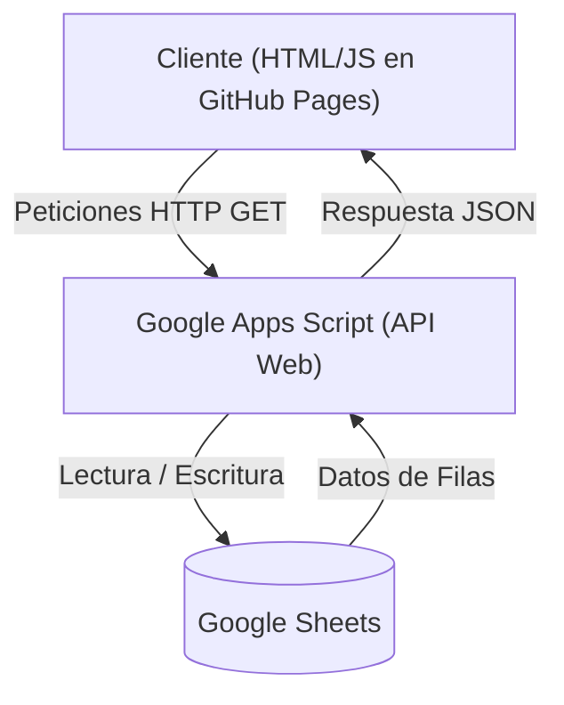
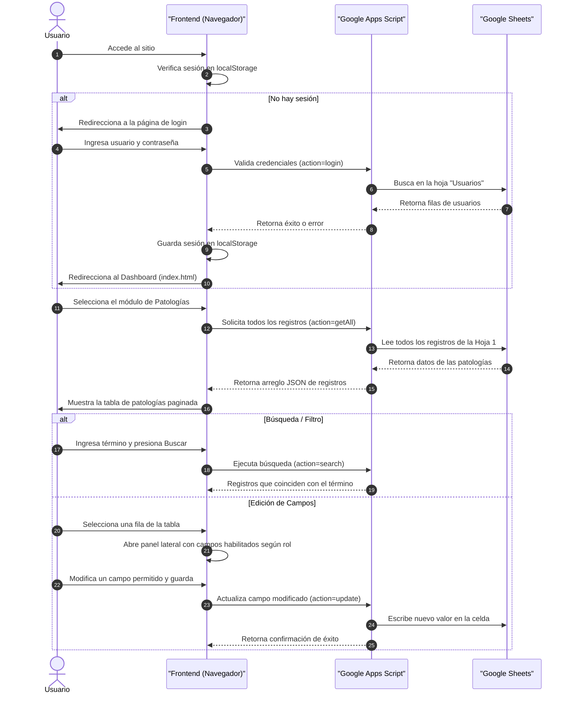
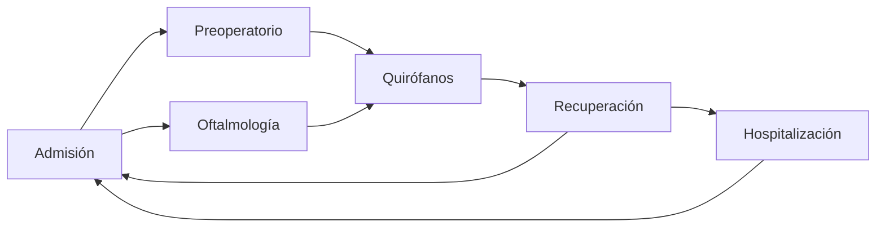
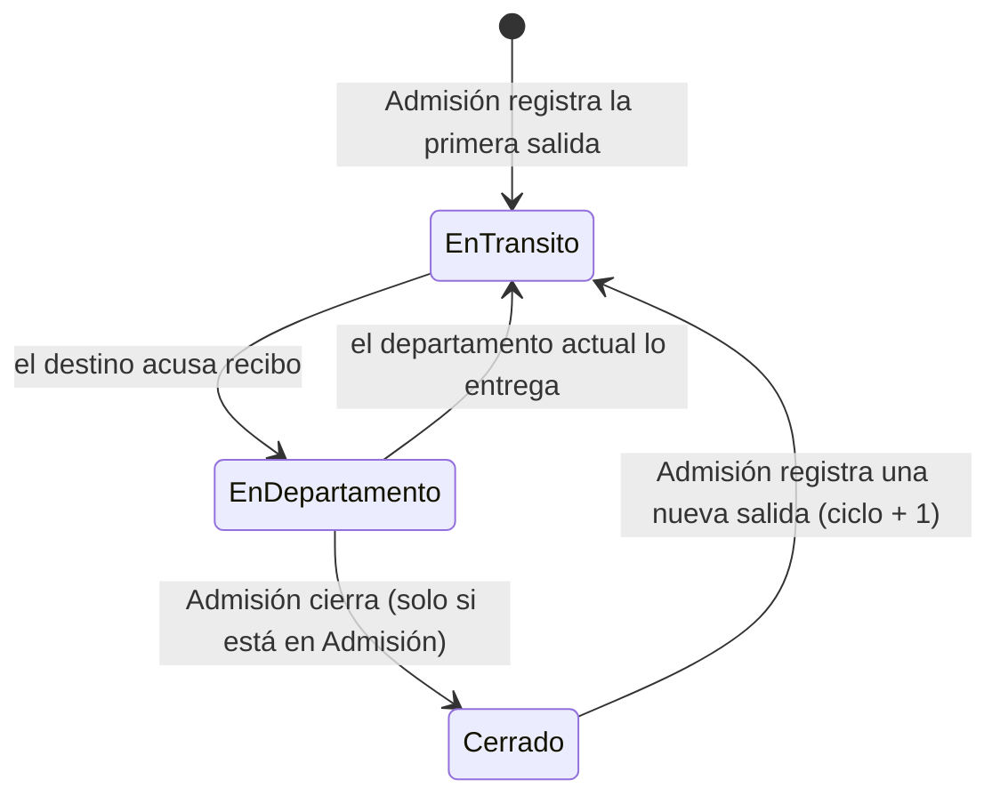

# Sistema de Gestión — Centro Médico San Lucas

Este proyecto es una aplicación web estática que agrupa los módulos operativos del **Centro Médico San Lucas**. Utiliza **Google Sheets** como base de datos en tiempo real y **Google Apps Script (GAS)** como API REST.

Módulos actuales:

| Módulo | Página | Qué resuelve |
| :--- | :--- | :--- |
| **Patologías** | `patologias.html` | Registro y seguimiento de estudios de patología. |
| **Bitácora de Expedientes** | `bitacora.html` | Rastreo del expediente clínico físico entre departamentos y tiempo que permanece en cada uno. Ver [sección 6](#6-módulo-bitácora-de-expedientes). |

---

## 1. Arquitectura y Conexiones

El sistema está dividido en dos capas principales: el frontend web (cliente) y el backend en la nube (servidor y base de datos).

### Detalles de la Conexión:
- **Protocolo de Comunicación**: El cliente se conecta al backend mediante peticiones HTTP `GET`.
- **Evasión de Limitaciones CORS**: Para evitar problemas de políticas de mismo origen (CORS) en el navegador, Google Apps Script devuelve las respuestas utilizando `ContentService` para servir un flujo de datos JSON (`ContentService.MimeType.JSON`).
- **Mecanismo de Reintento (Retry Logic)**: Debido a que Google Apps Script puede experimentar "arranques en frío" (cold-starts) o errores de red transitorios (devolviendo estados HTTP `404` o `>=500`), el cliente (en `js/api.js` y `js/auth.js`) implementa una función `fetchWithRetry` que realiza hasta 2 reintentos con un retraso exponencial automático antes de dar por fallida la operación.

---

## 2. Flujo de Trabajo (Workflow)

El flujo típico del usuario dentro de la aplicación sigue los siguientes pasos:

---

## 3. Gestión de Roles y Permisos

El sistema implementa un control de acceso basado en el nombre de usuario (normalizado a minúsculas y sin acentos). Este control define qué secciones del registro de patología son **editables** por cada perfil en el panel lateral.

Las secciones de campos definidas en el sistema son:
1. **Identificación**: Datos básicos (`Folio`, `Expediente`, `Nombre del Paciente`).
2. **Patología**: Detalles clínicos (`Nivel o Tipo de Patología`, `Fecha de entrega`, `Fecha de recepción de resultados digitales`, `Fecha de recepción de resultados físicos`, `Fecha Revisión del Médico`).
3. **Cita**: Seguimiento médico (`Requiere Cita`, `Fecha Cita`).
4. **Seguimiento**: Control de entrega (`Fecha de envío a Paciente`).
5. **Contabilidad**: Información financiera (`Monto`, `Fecha Pago Contabilidad`).

### Matriz de Permisos (Configurada en `js/config.js`):

| Usuario / Rol | Identificación | Patología | Cita | Seguimiento | Contabilidad | ¿Crear Nuevo Registro? |
| :--- | :---: | :---: | :---: | :---: | :---: | :---: |
| **admin** |  |  |  |  |  | **Sí** |
| **farmacia** |  |  |  |  | ❌ | **Sí** |
| **admision** | ❌ | ❌ |  |  | ❌ | **No** |
| **contabilidad** | ❌ | ❌ | ❌ | ❌ |  | **No** |

> [!NOTE]
> Si un usuario intenta editar una sección para la cual no tiene permisos, el panel lateral renderizará dichos campos como **de sólo lectura (readonly)** y mostrará un icono de candado () al lado de la sección.

---

## 4. Estructura del Proyecto

El repositorio está organizado de la siguiente manera:

*   **`index.html`**: El portal o Dashboard inicial del sistema que presenta los módulos de trabajo disponibles.
*   **`login.html`**: Interfaz de acceso para el inicio de sesión.
*   **`patologias.html`**: La vista principal del módulo de patologías, conteniendo la tabla de datos, barra de búsqueda, chips de filtros rápidos y el contenedor del panel lateral de edición.
*   **`bitacora.html`**: Vista del módulo de bitácora de expedientes clínicos.
*   **`apps_script/Codigo.gs`** *(fuera del repositorio, ver `.gitignore`)*: Copia local del backend — Patologías (`getAll`, `search`, `update`, `create`, `login`) y Bitácora (acciones `bit*`). El código real vive en el editor de Google Apps Script; esta carpeta es solo una copia de trabajo y **no se sirve desde GitHub Pages**.
*   **`css/`**: Hojas de estilo. `styles.css` contiene los tokens y componentes compartidos; `bitacora.css` añade lo específico del módulo de bitácora (línea de tiempo, insignias de estado, barras de resumen).
*   **`img/`**: Recursos gráficos de la aplicación (como el logotipo del Centro Médico).
*   **`js/`**: Archivos JavaScript de lógica en el cliente organizados de forma modular:
    *   [config.js](file:///c:/Users/Sistemas/Documents/AppScript/patologias_page/js/config.js): Archivo centralizado de configuración. Contiene la `API_URL` de Google Apps Script, la definición de campos (`FIELDS`), la matriz de permisos de usuario (`PERMISSIONS`) y el mapeo entre las claves internas de JS y los encabezados de la hoja de cálculo (`KEY_MAP`).
    *   [api.js](file:///c:/Users/Sistemas/Documents/AppScript/patologias_page/js/api.js): Contiene las funciones de comunicación HTTP con la API de Apps Script (`apiFetch`, `apiUpdateField`, `apiCreateRecord`) e integra la lógica de reintentos.
    *   [auth.js](file:///c:/Users/Sistemas/Documents/AppScript/patologias_page/js/auth.js): Maneja el estado de la sesión activa en el `localStorage`, el flujo de autenticación contra la base de datos y la verificación de permisos específicos del rol.
    *   [utils.js](file:///c:/Users/Sistemas/Documents/AppScript/patologias_page/js/utils.js): Funciones utilitarias para formatear fechas en formato local (es-MX), formatear montos monetarios, renderizar distintivos visuales (pills) para valores booleanos y normalizar los registros del servidor.
    *   [table.js](file:///c:/Users/Sistemas/Documents/AppScript/patologias_page/js/table.js): Controla el renderizado de la tabla interactiva de resultados en el DOM y gestiona el sistema de paginación del lado del cliente.
    *   [panel.js](file:///c:/Users/Sistemas/Documents/AppScript/patologias_page/js/panel.js): Controla el comportamiento del panel lateral derecho (abrir, cerrar, recopilar valores modificados y renderizar los campos según la matriz de permisos).
    *   [main.js](file:///c:/Users/Sistemas/Documents/AppScript/patologias_page/js/main.js): Orquestador general del módulo de patologías. Vincula los eventos del DOM (búsquedas, filtros rápidos, guardado y creación de registros) con el comportamiento de los demás módulos JavaScript.
    *   **`js/bitacora/`**: Módulo de bitácora de expedientes. Reutiliza `auth.js`, `utils.js` y la paginación de `table.js` del módulo de patologías.
        *   [config.js](js/bitacora/config.js): Catálogo de departamentos, flujo sugerido, mapa usuario→departamento y funciones de permiso (`puedeEntregar`, `puedeRecibir`, `puedeCerrar`…).
        *   [api.js](js/bitacora/api.js): Llamadas a las acciones `bit*` de Apps Script, con la misma lógica de reintentos.
        *   [render.js](js/bitacora/render.js): Formato de fechas y duraciones, tabla de expedientes y línea de tiempo del recorrido.
        *   [main.js](js/bitacora/main.js): Orquestador del módulo: carga, filtros, panel lateral y ejecución de movimientos.

---

## 5. Estructura de las Hojas de Cálculo (Base de Datos)

El libro de Google Sheets debe contener las siguientes hojas. Las dos primeras son del módulo de Patologías; `Expedientes` y `Bitacora` las crea automáticamente la función `bitInstalar` del script de Apps Script.

### Hoja 1: `Hoja 1` (Registros de Patologías)
Contiene la base de datos de los pacientes. Los encabezados en la fila 1 deben coincidir **exactamente** con el siguiente orden y nombre:

| Columna | Nombre del Encabezado (Fila 1) | Descripción |
| :--- | :--- | :--- |
| **A** | `Folio` | Identificador único del estudio (obligatorio). |
| **B** | `Expediente` | Número de expediente del paciente. |
| **C** | `Nombre del Paciente` | Nombre completo del paciente. |
| **D** | `Nivel o Tipo de Patología` | Clasificación o nivel de la patología. |
| **E** | `Fecha de entrega` | Fecha de entrega del estudio al laboratorio. |
| **F** | `Fecha de recepción de resultados` | Fecha de recepción de resultados digitales. |
| **G** | `Patología Física Recibida` | Fecha de recepción física de los resultados. |
| **H** | `Fecha Revisión del Médico` | Fecha en la que el médico revisó el resultado. |
| **I** | `Requiere Cita` | Indica si requiere cita de seguimiento (`Sí` / `No`). |
| **J** | `Fecha Cita` | Fecha programada para la cita. |
| **K** | `Enviado a Paciente` | Fecha en que se le enviaron los resultados al paciente. |
| **L** | `Monto` | Monto del estudio. |
| **M** | `Fecha Pago Contabilidad` | Fecha de registro de pago en contabilidad. |

> [!NOTE]
> Además de las anteriores, la hoja debe tener una columna con encabezado `ID` (identificador autoincremental). `handleUpdate` y `handleCreate` la buscan por nombre, así que puede estar en cualquier posición, pero si falta ambas operaciones fallan.

### Hoja 2: `Usuarios` (Credenciales del Personal)
Contiene las credenciales para la autenticación de usuarios.

| Columna | Nombre del Encabezado (Fila 1) | Descripción |
| :--- | :---: | :--- |
| **A** | `Usuario` | Nombre de usuario. |
| **B** | `Clave` | Contraseña asignada al usuario. |

Usuarios esperados por el sistema:

| Usuario | Patologías | Bitácora |
| :--- | :--- | :--- |
| `admin` | Todas las secciones + crear | Superusuario: opera a nombre de cualquier departamento y puede deshacer |
| `farmacia` | Identificación, Patología, Cita + crear | Solo lectura |
| `contabilidad` | Contabilidad | Solo lectura |
| `admision` | Cita, Seguimiento | Departamento **Admisión** |
| `preoperatorio` | — | Departamento **Preoperatorio** |
| `oftalmologia` | — | Departamento **Oftalmología** |
| `quirofanos` | — | Departamento **Quirófanos** |
| `recuperacion` | — | Departamento **Recuperación** |
| `hospitalizacion` | — | Departamento **Hospitalización** |

> [!IMPORTANT]
> Los cinco usuarios de departamento son **nuevos**: hay que darlos de alta manualmente en la hoja `Usuarios` para que el módulo de bitácora funcione. Como no aparecen en la matriz `PERMISSIONS` de `js/config.js`, en el módulo de Patologías no pueden editar nada, que es el comportamiento deseado.

### Hoja 3: `Expedientes` (Estado actual de cada expediente)
Una fila por expediente. Refleja **dónde está ahora**; el historial vive en la hoja `Bitacora`.

| Columna | Encabezado | Descripción |
| :--- | :--- | :--- |
| **A** | `ID` | UUID interno. |
| **B** | `Expediente` | Número de expediente (clave única, se guarda en mayúsculas). |
| **C** | `Nombre del Paciente` | Nombre completo. |
| **D** | `Departamento Actual` | Dónde está el expediente. Si va en tránsito, el departamento que lo entregó. |
| **E** | `Estado` | `En departamento` · `En tránsito` · `Cerrado`. |
| **F** | `Destino Pendiente` | Solo cuando está en tránsito: a quién va dirigido. |
| **G** | `Fecha Apertura` | ISO 8601. Momento de la primera salida de Admisión. |
| **H** | `Última Actualización` | ISO 8601. Base del cálculo de "tiempo sin moverse". |
| **I** | `Fecha Cierre` | ISO 8601. Se llena al cerrar el ciclo. |
| **J** | `Total Movimientos` | Contador de entregas del ciclo actual. |
| **K** | `Ciclo` | Se incrementa cada vez que un expediente cerrado vuelve a salir. |
| **L** | `Observaciones` | Texto libre. |

### Hoja 4: `Bitacora` (Historial de movimientos)
Una fila por **entrega**. Es la tabla que responde "¿por dónde pasó y cuánto tardó?".

| Columna | Encabezado | Descripción |
| :--- | :--- | :--- |
| **A** | `ID` | UUID del movimiento. |
| **B** | `Expediente` | Número de expediente. |
| **C** | `Origen` | Departamento que entrega. |
| **D** | `Destino` | Departamento que recibe. |
| **E** | `Fecha Entrega` | ISO 8601. |
| **F** | `Usuario Entrega` | Quién registró la salida. |
| **G** | `Fecha Recepción` | ISO 8601. Vacío mientras nadie acuse recibo. |
| **H** | `Usuario Recepción` | Quién confirmó la llegada. |
| **I** | `Minutos Traslado` | `Fecha Recepción − Fecha Entrega`. Tiempo que el expediente anduvo "en el aire". |
| **J** | `Minutos Estancia Destino` | Tiempo que el expediente permaneció en `Destino`. Se calcula cuando ese departamento lo entrega al siguiente (o al cerrarse el ciclo). |
| **K** | `Estado Movimiento` | `En tránsito` · `Recibido` · `Cerrado` · `Cancelado`. |
| **L** | `Ciclo` | Ciclo al que pertenece el movimiento. |
| **M** | `Observaciones` | Texto libre de entrega y recepción. |

> [!TIP]
> Con las columnas **I** y **J** puedes armar tablas dinámicas directamente en Sheets: promedio de estancia por departamento, cuellos de botella por mes, o traslados que tardaron más de X minutos.

---

## 6. Módulo: Bitácora de Expedientes

Resuelve el problema de los expedientes clínicos físicos que se pierden entre departamentos: registra cada movimiento, quién lo entregó, quién lo recibió y cuánto tiempo estuvo en cada lugar.

### 6.1 Modelo: entrega + acuse de recibo

Cada traslado son **dos registros**, no uno:

1. El departamento que tiene el expediente registra **a quién se lo entrega**.
2. El departamento destino **confirma que lo recibió**.

Entre ambos momentos el expediente queda `En tránsito`: salió de un lado y nadie ha confirmado que llegó al otro. Ese es exactamente el hueco donde se pierden, y el sistema lo muestra en amarillo con el filtro *"En tránsito (sin acuse)"*.

### 6.2 Flujo del expediente

El flujo es una **sugerencia, no una restricción**: el panel preselecciona el siguiente paso habitual bajo el grupo *"Siguiente paso habitual"*, pero cualquier departamento puede aparecer como destino en *"Otros departamentos"*. La realidad del hospital no siempre sigue el camino ideal y forzarlo solo provocaría que se dejen de registrar movimientos.

El ciclo termina cuando el expediente regresa a Admisión y Admisión lo **cierra**.

### 6.2.1 Cuando el paciente regresa

No se da de alta otra vez: el expediente ya existe y se reutiliza su registro. Hay dos caminos, ambos abren un **ciclo nuevo** conservando íntegro el historial anterior:

* **Desde el expediente**: buscarlo por número (la búsqueda sí muestra los cerrados, aunque no aparezcan en la lista de trabajo) y usar el botón **"Registrar nueva salida"** que aparece en el panel. Solo pide destino y observaciones.
* **Desde "Nueva salida"**: al escribir un número que ya existe y salir del campo, el nombre se completa solo y un aviso indica qué ciclo se abrirá. Si el expediente todavía está activo en otro departamento, el aviso lo señala y el botón de guardar se bloquea.

> [!IMPORTANT]
> Al reabrir, el backend **conserva el nombre ya registrado e ignora el que venga en la petición**. Es deliberado: si Admisión reescribiera *"Maria Vasquez"* donde decía *"María Elena Vázquez Ruiz"*, el nombre bueno se perdería y las búsquedas por nombre dejarían de encontrar el expediente. Para corregir un nombre mal capturado se edita la celda en la hoja `Expedientes`.

### 6.3 Ciclo de vida y reglas de permiso

| Acción | Quién puede |
| :--- | :--- |
| Registrar la primera salida / reabrir | `admision`, `admin` |
| Registrar una entrega | Únicamente el departamento donde está el expediente, o `admin` |
| Confirmar recepción | Únicamente el departamento destino, o `admin` |
| Cerrar el expediente | `admision`, `admin` — y solo si el expediente ya regresó a Admisión |
| Deshacer el último paso | `admin` |
| Consultar | Todos los usuarios |

Las reglas están escritas dos veces a propósito: en `js/bitacora/config.js` para ocultar botones, y en `Codigo.gs` para **validar de verdad**. El frontend es una comodidad; la autoridad es el backend, porque cualquiera puede llamar la URL de la API a mano.

### 6.4 Cómo se mide el tiempo

* **Traslado** = `Fecha Recepción − Fecha Entrega`. Cuánto tardó en llegar físicamente.
* **Estancia** = `Fecha Entrega del siguiente movimiento − Fecha Recepción`. Cuánto se quedó parado en ese departamento.

La estancia del departamento actual todavía no tiene un valor final, así que el panel la calcula contra el reloj y la muestra como *"(en curso)"*. Los minutos se congelan en la hoja de cálculo hasta que el expediente sale de ahí.

Todas las marcas de tiempo se guardan en **ISO 8601 UTC** y se convierten a hora local (`es-MX`, reloj de 24 h) al mostrarlas, para que no dependan de la zona horaria configurada en el proyecto de Apps Script.

### 6.5 Alertas

Configurables en la constante `ALERTA` de `js/bitacora/config.js`:

| Situación | Umbral por defecto |
| :--- | :--- |
| En tránsito sin acuse de recibo | 60 minutos |
| Detenido en un mismo departamento | 24 horas |

Al superarse, la fila se pinta de ámbar con un ⚠ y el expediente aparece en el contador *"Detenidos"* y en su filtro.

### 6.6 Deshacer

Solo el superusuario, y de un nivel. Revierte el último paso respetando su granularidad real:

| Último paso registrado | Qué hace deshacer |
| :--- | :--- |
| Cierre | Reabre el expediente en Admisión |
| Recepción | Vuelve a dejarlo `En tránsito` hacia el mismo destino |
| Entrega | Cancela la entrega y regresa el expediente a su origen |

Las entregas canceladas **no se borran**: quedan en la hoja con `Estado Movimiento = Cancelado` y se ven tachadas en la línea de tiempo. La bitácora es un documento de control, así que conviene que las correcciones sean visibles.